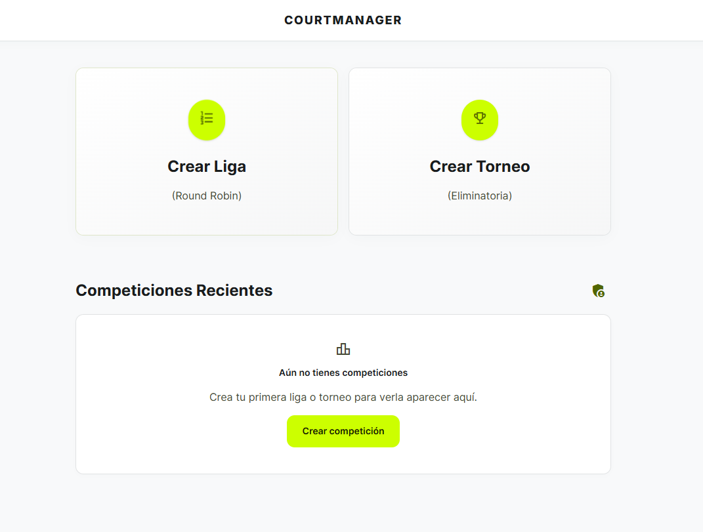
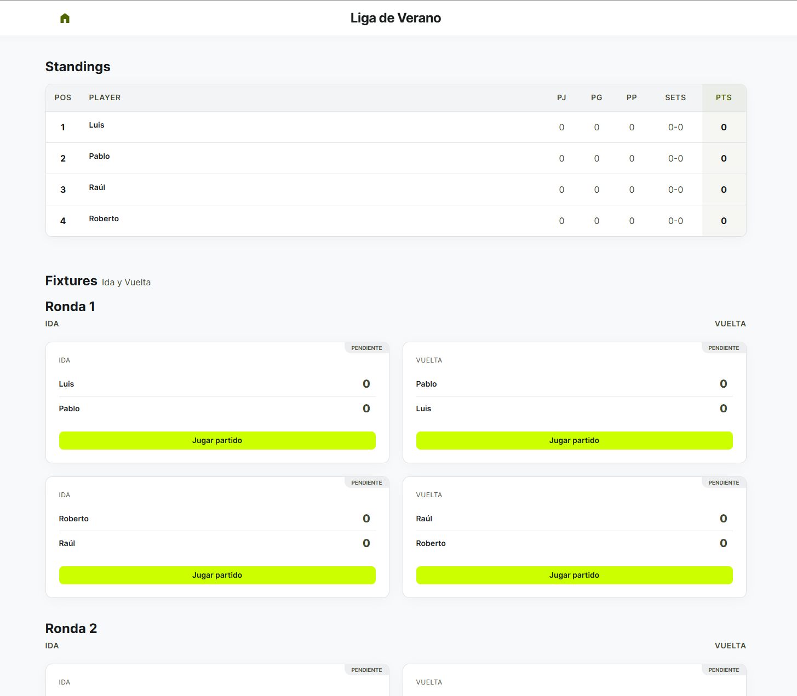
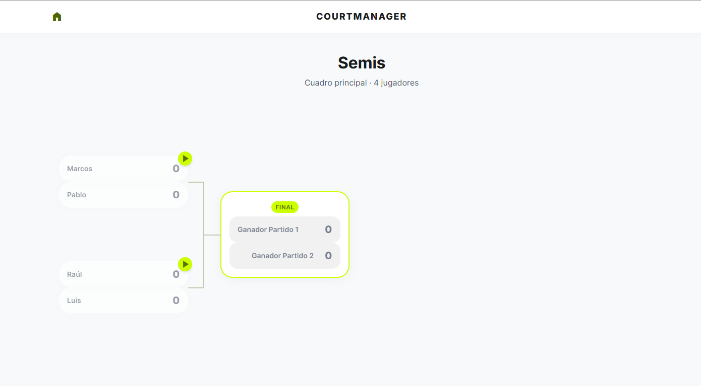

# CourtManager 🎾

> Gestor profesional de torneos y ligas de tenis — del sorteo al saque final.

[](./tests)
[](https://www.python.org/)
[](https://reflex.dev/)
[](LICENSE)
[](./tests/unit)
[](https://github.com/davidsored/TennisTournament)

<p align="center">
  
</p>

---

## ¿Qué es CourtManager?

**CourtManager** es una aplicación web full-stack para organizar competiciones de tenis: desde una liga vecinal hasta un torneo eliminatorio con sembrado y BYEs. Diseñada con un único objetivo: **que arbitrar un partido sea tan rápido como pulsar dos botones**.

Pensada para clubs, organizadores aficionados y profesores que necesitan una herramienta sencilla pero rigurosa, sin hojas de cálculo, sin papel y sin errores de cuenta.

### Funcionalidades clave

| Módulo | Qué hace |
| --- | --- |
| 🏆 **Ligas (Round Robin)** | Genera el calendario completo ida y vuelta con el algoritmo del círculo. Tabla de clasificación con desempates por sets y orden alfabético. |
| 🎯 **Torneos eliminatorios** | Cuadros con sembrado aleatorio, distribución de BYEs (nunca se enfrentan entre sí), propagación automática del ganador a la siguiente ronda. |
| ⏱️ **Marcador en vivo** | Máquina de estados completa: 0 → 15 → 30 → 40, deuce, ventaja, tie-break (configurable), partidos al mejor de N sets / M juegos. |
| 💾 **Persistencia robusta** | Postgres (Supabase) en producción, SQLite en local. Migraciones gestionadas con Alembic. |
| 🌗 **Modo administrador** | Acciones destructivas (borrado de competiciones) protegidas por clave; sesión persistida vía `LocalStorage`. |

<p align="center">
  
  &nbsp;
  
</p>
<p align="center"><em>Dashboard de liga (Round Robin) y cuadro eliminatorio en acción.</em></p>

---

## Tech Stack

- **Frontend + Backend:** [Reflex 0.9](https://reflex.dev/) (Python end-to-end, sin tocar JS)
- **ORM y BD:** [SQLModel](https://sqlmodel.tiangolo.com/) + SQLAlchemy 2.0 + PostgreSQL (Supabase) / SQLite
- **Migraciones:** Alembic
- **Estilos:** Tailwind CSS v4 con sistema de diseño "Advantage" (Material 3 + tipografía Inter)
- **Testing:** Pytest + pytest-cov + Playwright + pytest-playwright
- **Deployment:** Reflex Hosting / Docker

---

## 🧪 Pirámide de Testing — 138 tests automatizados

CourtManager se construye sobre una suite de tests con **3 niveles de cobertura** que protegen el dominio del juego, la persistencia y el flujo de usuario.

```
       ╱╲
      ╱E2E╲          3 tests Playwright (flujos UI completos)
     ╱──────╲
    ╱  Integ ╲       28 tests con BD SQLite en memoria
   ╱──────────╲
  ╱   Unit     ╲    107 tests puros (sin DB, sin red, sin UI)
 ╱──────────────╲
```

### 🟢 Unit (`tests/unit/`) — Lógica de negocio pura

100 % de cobertura sobre `TennisTournament/logic/` y el motor de puntuación. Tests deterministas que corren en milisegundos:

- **Motor de tenis** (`test_match_logic.py`): puntuación 0/15/30/40, deuce/advantage, tie-break a 7 con diferencia de 2, validación de resultados imposibles (no se llega a 7-6 sin pasar por 5-5), `config_games` configurable.
- **Cuadros eliminatorios** (`test_tournament_engine.py`): cálculo de bracket size, distribución de BYEs sin BYE-vs-BYE, planificación completa con propagación de ganadores e índices locales.
- **Clasificación de liga** (`test_standings.py`): puntos por victoria, desempates encadenados (puntos → diferencia de sets → orden alfabético).
- **Fixtures** (`test_fixtures.py`): emparejamiento ida/vuelta por índice, flags de ganador, asimetría defensiva.

### 🔵 Integration (`tests/integration/`) — Persistencia + States

Cada test arranca con una **BD SQLite en memoria** limpia (fixture `test_db_engine` con `scope="function"`) y mockea `rx.session()` para garantizar que **ningún test toca Supabase**.

- **Ligas** (`test_league_integration.py`): creación de `League`, generación del calendario Round Robin, persistencia de `config_games` en cada `LeagueMatch`, lectura de standings desde DB → `MatchView` → `compute_standings`.
- **Torneos** (`test_tournament_integration.py`): bracket completo en BD, cableado de `next_match_id`, finalización automática de BYEs, **propagación E2E del ganador**: réplica 1:1 del método `LeagueState.record_result` que verifica que el winner aparece en el slot correcto del partido siguiente tras cerrar el partido en BD.

### 🟣 E2E (`tests/e2e/`) — Flujo de usuario con Playwright

Tres flujos críticos validados sobre la aplicación real corriendo en `localhost:3000`. Patrón **Page Object Model** estricto, locators 100 % user-centric (`get_by_role`, `get_by_text`, `get_by_placeholder`):

- **Flow A — Liga**: crear liga con 3 jugadores y 4 juegos por set, verificar que aparecen todos en standings.
- **Flow B — Torneo + avance del ganador**: crear cuadro de 4, ganar el primer partido, verificar visualmente que el ganador avanza a la final.
- **Flow C — Persistencia de Estado**: Validación de que las competiciones creadas aparecen y persisten correctamente en el Dashboard de "Competiciones Recientes" tras la navegación.

Cada test E2E captura **screenshot automático** en caso de fallo (hook `pytest_runtest_makereport`).

---

## 🚀 Instalación

### Requisitos previos
- Python 3.12+
- (Opcional) PostgreSQL 14+ o cuenta de Supabase para producción

### Setup local

```bash
# 1. Clonar el repo
git clone https://github.com/davidsored/TennisTournament.git
cd TennisTournament

# 2. Crear y activar el venv
python -m venv .venv
source .venv/bin/activate         # Linux / macOS
# .venv\Scripts\activate           # Windows

# 3. Instalar dependencias
pip install -r requirements.txt

# 4. Variables de entorno (.env en la raíz)
cat > .env <<'EOF'
DATABASE_URL=sqlite:///reflex.db
ADMIN_KEY=cambia-esta-clave
EOF

# 5. Aplicar migraciones
reflex db migrate

# 6. Levantar la app
reflex run
```

La app queda disponible en **http://localhost:3000** (frontend) y **http://localhost:8000** (backend WS).

---

## 🧪 Ejecución de los tests

```bash
# Suite completa (unit + integration; ~5 segundos)
pytest tests/unit tests/integration -v

# Solo unitarios (super rápido)
pytest tests/unit -v

# Con cobertura
pytest tests/unit --cov=TennisTournament/logic --cov-report=term-missing

# Tests E2E (requiere reflex run en otra terminal + playwright install)
playwright install chromium
pytest tests/e2e -v --headed             # con navegador visible
pytest tests/e2e -v                      # headless (CI)
```

> 📖 Más detalles E2E en [`README_E2E.md`](./README_E2E.md) y testing general en [`TESTING.md`](./TESTING.md).

---

## 📂 Estructura del proyecto

```
TennisTournament/
├── logic/              ← Lógica de negocio pura (testeable sin Reflex)
│   ├── tournament_engine.py
│   ├── standings.py
│   └── fixtures.py
├── models/             ← rx.Model + SQLModel (League, Tournament, Match…)
├── states/             ← rx.State (LeagueState, ScoreboardState…)
├── pages/              ← Páginas Reflex (home, scoreboard, dashboards…)
└── components/         ← UI reutilizable (top bar, bento cards, brackets…)

tests/
├── unit/               ← 107 tests sin dependencias externas
├── integration/        ← 28 tests con SQLite en memoria
└── e2e/
    ├── pages/          ← Page Objects (POM)
    └── specs/          ← Tests Playwright
```

---

## 🤝 Contribuir

¿Bug, idea o mejora? Abre un [issue](https://github.com/davidsored/TennisTournament/issues) o un [pull request](https://github.com/davidsored/TennisTournament/pulls).

Antes de mandar un PR:

1. Asegura que `pytest tests/unit tests/integration` pasa al 100 %.
2. Si tocas la UI, ejecuta los E2E (`pytest tests/e2e --headed`) y adjunta capturas si añades flujos.
3. Sigue el sistema de diseño documentado en [`DESIGN.md`](./DESIGN.md).

---

## 📜 Licencia

MIT — ver [`LICENSE`](./LICENSE).

---

<p align="center">Hecho con 🎾 y mucho café.</p>
